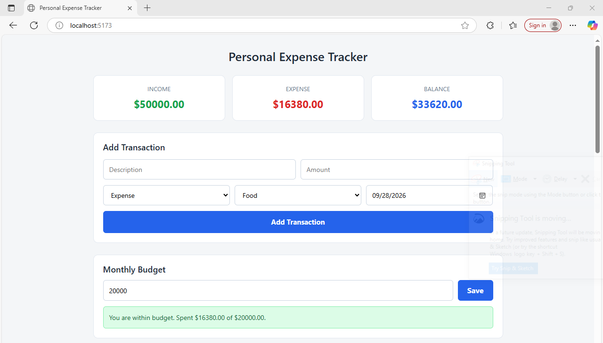
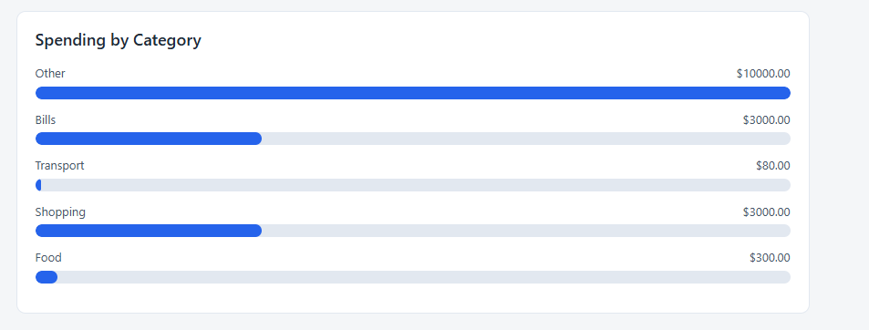
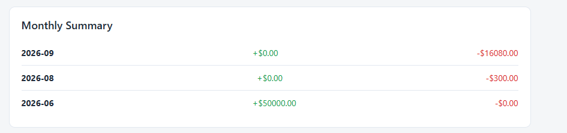
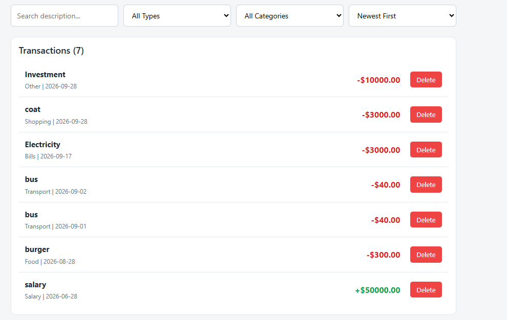

# Personal Expense Tracker

A single-page React application that lets users log their income and expenses, view their running balance, and understand their spending habits at a glance. All data is stored in the browser using localStorage, so no backend, API, or sign-up is required.

## Features

- Add income and expense transactions with description, amount, category, and date
- Running balance showing total income, total expense, and current balance
- Delete individual transactions from the list
- Filter transactions by type, category, and search text
- Sort transactions by date or amount
- Bar chart showing spending grouped by category
- Monthly summary view that groups income and expenses by month
- Budget limit with a warning when total expenses exceed it
- All data persists across page refreshes using localStorage

## Technologies Used

- React 18 (functional components and hooks)
- Vite (build tool and development server)
- JavaScript (ES6+)
- Plain CSS
- localStorage
- Git and GitHub

## Setup Instructions

1. Make sure Node.js (version 18 or newer) is installed on your machine.
2. Clone the repository and open a terminal in the project folder.
3. Run `npm install` to install all dependencies.
4. Run `npm run dev` to start the development server.
5. Open the URL shown in the terminal (usually http://localhost:5173) in your browser.

To build the app for production, run `npm run build` followed by `npm run preview`.

## Screenshots

## Known Limitations

- The app assumes a single currency (USD) and does not support currency conversion.
- Transactions cannot be edited after they are added; they can only be deleted and recreated.
- Data is stored only in the browser, so clearing browser data will erase everything.
- The chart is a simple CSS bar chart and is not interactive.
- There is no user authentication, so anyone using the same browser sees the same data.
